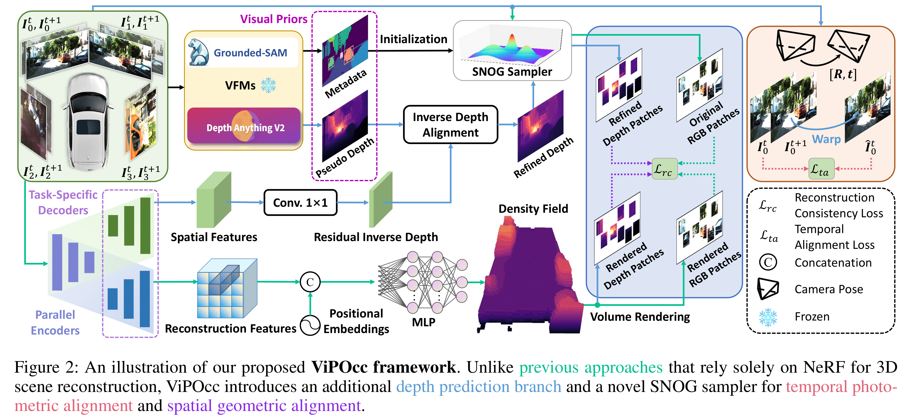

# ViPOcc: Leveraging Visual Priors from Vision Foundation Models for Single-View 3D Occupancy Prediction (AAAI-25 Oral)

### [**Paper**](https://arxiv.org/abs/2412.11210) | [**Video**](https://www.bilibili.com/video/BV1ynqZYNENh/) | [**Project Page**](https://mias.group/ViPOcc)

This is the official implementation for [ViPOcc](https://arxiv.org/abs/2412.11210):

> ViPOcc: Leveraging Visual Priors from Vision Foundation Models for Single-View 3D Occupancy Prediction

> [Yi Feng](https://scholar.google.com/citations?user=8B5sG_wAAAAJ&hl=zh-CN), [Yu Han](https://openreview.net/profile?id=~Yu_Han7) , [Xijing Zhang](https://openreview.net/profile?id=~Xijing_Zhang1), [Tanghui Li](https://openreview.net/profile?id=~Tanghui_Li1), [Yanting Zhang](https://openreview.net/profile?id=~Yanting_Zhang1), [Rui Fan](https://scholar.google.com/citations?user=P5AJTXcAAAAJ&hl=en)


# 📋 Abstract

Inferring the 3D structure of a scene from a single image is an ill-posed and challenging problem in the field of vision-centric autonomous driving. Existing methods usually employ neural radiance fields to produce voxelized 3D occupancy, lacking instance-level semantic reasoning and temporal photometric consistency. In this paper, we propose ViPOcc, which leverages the visual priors from vision foundation models (VFMs) for fine-grained 3D occupancy prediction. Unlike previous works that solely employ volume rendering for RGB and depth image reconstruction, we introduce a metric depth estimation branch, in which an inverse depth alignment module is proposed to bridge the domain gap in depth distribution between VFM predictions and the ground truth. The recovered metric depth is then utilized in temporal photometric alignment and spatial geometric alignment to ensure accurate and consistent 3D occupancy prediction. Additionally, we also propose a semantic-guided non-overlapping Gaussian mixture sampler for efficient, instance-aware ray sampling, which addresses the redundant and imbalanced sampling issue that still exists in previous state-of-the-arts. Extensive experiments demonstrate the superior performance of ViPOcc in both 3D occupancy prediction and depth estimation tasks on the KITTI-360 and KITTI Raw datasets.

# 🪧 Overview



- We propose ViPOcc, a single-view 3D Occupancy prediction framework that incorporates Visual Priors from VFMs. ViPOcc takes stereo image pairs, rectified fisheye images, and camera projection matrices as input, and generates 2D depth estimations and 3D occupancy predictions simultaneously. 

- The Inverse Depth Alignment module effectively aligns VFM's depth priors with real-world depth distributions while preserving their local differential properties.  

- The proposed SNOG sampler effectively guides the framework to focus more on crucial instances and avoid overlapping patches during ray sampling.

- Reconstruction consistency loss and temporal alignment loss are proposed to ensure inter-frame photometric consistency and intra-frame geometric reconstruction consistency. 


# 🏗️️ Installation

Follow detailed instructions in [Installation](docs/installation.md).

# 💾 Dataset Preparation

Follow detailed instructions in [Datasets Preparation](docs/prepare_dataset.md).


# 📸 Checkpoints

The official weights of our model ViPOcc can be downloaded [here](https://1drv.ms/f/c/442eec1e53c2e4bf/Eq04KJ0xtVBOjJ16ylB7zJEBByI7ELUIpiXLEJTYURiTaA?e=fEr1WT).

The official weights of BTS can be downloaded [here](https://github.com/Brummi/BehindTheScenes/). Rename it to `BTS-KITTI-360.pt`. 

Checkpoints should be put in the `checkpoints/` directory.

# 📽 Demo

We provide a shell script to generate **3D occupancy predictions, predicted depth maps, rendered depth maps, pseudo depth maps, and bev maps**:

```bash
python eval.py -cn demo \
  'model_conf.backbone.use_depth_branch=true' \
  'model_conf.draw_occ=true' \
  'model_conf.draw_rendered_depth=true' \
  'model_conf.draw_pred_depth=true' \
  'model_conf.draw_pseudo_depth=true' \
  'model_conf.draw_bev=true' \
  'model_conf.save_dir="visualization/vipocc"'
```

# 📊 Evaluation

We provide [evaluation scripts](./scripts/eval.sh) to (1) reproduce the ViPOcc evaluation results for 3D occupancy prediction and depth estimation, (2) evaluate performance of Depth Anything V2, and (3) reproduce the BTS evaluation results.

```bash
# ============== ViPOcc Evaluation ==============

# eval occ
python eval.py -cn eval_lidar_occ


# eval rendered depth
python eval.py -cn eval_depth_kitti360


# eval predicted depth
python eval.py -cn eval_depth_kitti360 \
  "model_conf.eval_rendered_depth=false"

# ============== BTS Official Evaluation ==============
# KITTI-360, occupancy prediction
python eval.py -cn eval_lidar_occ \
"checkpoint=\"checkpoints/BTS-KITTI-360.pt\"" \
'model_conf.z_range=[20, 4]' \
'model_conf.backbone.use_depth_branch=false'


# KITTI-360, depth estimation
python eval.py -cn eval_depth_kitti360 \
"checkpoint=\"checkpoints/BTS-KITTI-360.pt\""


# ============== Depth Anything V2 Evaluation ==============
# KITTI-360, pseudo depth estimation (median scaling)
python eval.py -cn eval_pseudo_depth

# (no scaling)
python eval.py -cn eval_pseudo_depth \
'model_conf.depth_scaling=null'

```

# 🏋 Training

We provide [training scripts](./scripts/train.sh) for ViPOcc. It can be trained on a single Nvidia 4090 GPU.

```bash
python train.py -cn exp_kitti_360
```

# 🗣️ Acknowledgements

Our code is based on [BTS](https://github.com/Brummi/BehindTheScenes)
and [KYN](https://github.com/ruili3/Know-Your-Neighbors).
We sincerely appreciate their amazing works.

Many thanks to these excellent open-source projects:
[MonoDepth2](https://github.com/nianticlabs/monodepth2),
[PixelNerf](https://github.com/sxyu/pixel-nerf),
[Depth Anything V2](https://github.com/DepthAnything/Depth-Anything-V2),
[Grounded-SAM](https://github.com/IDEA-Research/Grounded-Segment-Anything).


KITTI360 dataset config

| params                    | default         | train           | validation      | eval_depth_kitti360 | eval_lidar_occ  | eval_voxel      | demo            |
| ---------------           | --------------- | --------------- | --------------- | ---------------     | --------------- | --------------- | --------------- |
| split_path                |                 | train_files.txt | val_files.txt   | test_files.txt      | test_files.txt  | test_files.txt  |                 |
| target_image_size         | 192x640         | 192x640         | 192x640         | 192x640             | 192x640         | 192x640         |                 |
| return_stereo             | F               | T               | T               | T                   | F               | F               |                 |
| resurn_fisheye            | T               | T               | T               | F                   | F               | F               |                 |
| return_segmentation       | F               | F               | F               | F                   | F               | F               |                 |
| return_voxel              | F               | F               | F               | F                   | F               | T               |                 |
| return_gt_depth           | F               | T               | T               | T                   | F               | F               |                 |
| return_pseudo_depth       | F               | T               | T               | T                   | F               | F               |                 |
| return_samples            | F               | F               | F               | F                   | F               | F               |                 |
| return_3d_bboxes          | F               | T               | T               | T                   | T               | T               |                 |
| bboxes_semantic_labels    | \[car\]         | \[car\]         | \[car\]         | \[car\]             | \[car\]         | \[car\]         |                 |
| bbox_all_verts_in_frustum | T               | T               | T               | T                   | T               | T               |                 |
| frame_count               | 2               | 2               | 2               | 1                   | 1               | 1               |                 |
| keyframe_offset           | 0               | 0               | 0               | 0                   | 0               | 0               |                 |
| dilation                  | 1               | 1               | 1               | 1                   | 1               | 1               |                 |
| fisheye_rotation          | 0               | \[0,-15\]       | \[0,-15\]       | -15                 | -15             | -15             |                 |
| fisheye_offset            | 0               | 10              | 10              | 10                  | 10              | 10              |                 |
| color_aug                 | F               | F               | F               | F                   | F               | F               |                 |
| is_preprocessed           | F               | T               | T               | T                   | T               | T               |                 |
| variant_fisheye_offset    | F               | F               | F               | F                   | F               | F               |                 |
| low_fisheye_offset        | None            | F               | None            | None                | None            | None            |                 |
| up_fisheye_offset         | None            | F               | None            | None                | None            | None            |                 |
